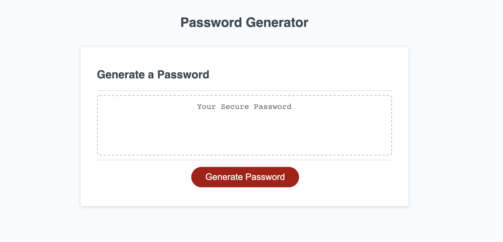

# PasswordGenerator

## Deployed

[This is the deployed web application.](https://christinakerr.github.io/PasswordGenerator/) 

## Purpose

This application generates a random password based on the user's criteria. The user can choose the length of the password from 8 to 128, as well as whether it will include lowercase characters, uppercase characters, numbers, and/or special characters. These randomly generated passwords are more secure than the typical word-based passwords that many people use.

## Tech

This application leverages:

* HTML
* CSS
* JavaScript

